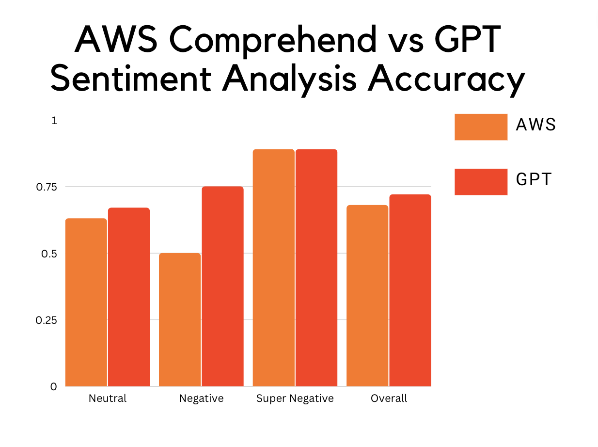

# From Frustration to Innovation: Improving Customer Service with Sentiment Analysis

Group: Harry Chen, Wendy Wang, Connie He, Yijun Liu, Jonathan Wuyan, and Eric Xue

This GitHub repository contains the code and resources for a sentiment analysis project aimed at improving customer service in phone calls. The goal of the project is to enhance user experience, increase brand loyalty, and improve customer satisfaction by using machine learning algorithms to perform sentiment analysis on customer service calls.

## Problem Statement
The current customer service process involves using chatbots to assist customers. However, chatbots can be frustrating for customers due to misinterpretation of requests and poor categorization. The project aims to explore the cause of these problems and evaluate the promises of using sentiment analysis algorithms in customer service to improve user experience.

## Approach
The project consists of three main phases:

- Testing ML API (GPT-3.5) (AWS Transcribe) to evaluate the accuracy of transcription and determine if it contributes to the misinterpretation of requests.
- Using sentiment analysis algorithms to identify negative emotions and categorize customers' sentiments into neutral, negative, and super negative.
- Evaluating the performance of state-of-the-art sentiment analysis algorithms in the customer service domain, particularly when interacting with customers through chatbots.

## Architecture
The project architecture consists of two main components:

- AWS Transcribe - a cloud-based automatic speech recognition (ASR) service that transcribes audio files into text.
- GPT-3.5 - a state-of-the-art language model that is used for natural language processing (NLP) and sentiment analysis.
- AWS Comprehend - a cloud-base language model for NLP and sentiment analysis 

Here's an architecture diagram 

## Results
The project successfully evaluated the performance of AWS Transcribe and GPT-3.5 for transcription and sentiment analysis, respectively. The transcription error rate was low, indicating that the program accurately transcribed the audio files into text. However, the classification accuracy of GPT-3.5 was low, indicating that the chatbot failed to classify the requests correctly. Incorporating sentiment analysis algorithms, such as AWS Comprehend and GPT, improved the accuracy of classification and provided a possible solution for the frustration experienced by customers.

## Conclusion
The project demonstrates the potential of using sentiment analysis algorithms to improve customer service in the telecommunication industry. By identifying negative emotions and categorizing customers' sentiments into neutral, negative, and super negative, chatbots can provide more thoughtful customer service procedures, reduce customer churn, and even attract new customers. The project's results can serve as a basis for further research and development in the field of customer service using NLP and sentiment analysis algorithms.

